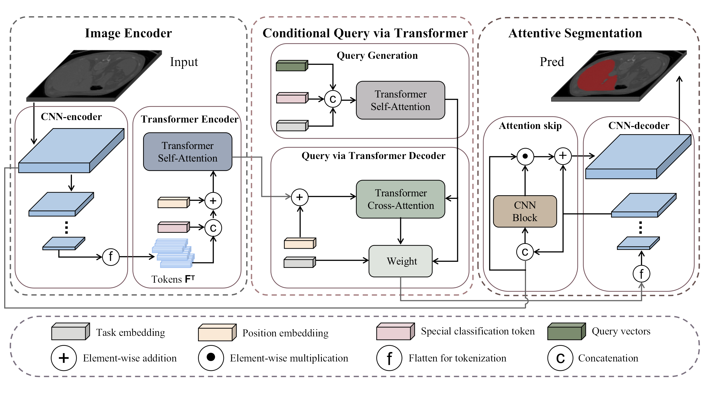

# CQTr
<p align="left">
    
</p>


This repo holds the pytorch implementation of CQTr:<br />

**CQTr: Conditional Query via Transformer for Partially Labeled Multi-Organ and Tumor Segmentation**


## Requirements
Python 3.7.6<br />
PyTorch==1.7.1<br />
[batchgenerators](https://github.com/MIC-DKFZ/batchgenerators)<br />

## Usage

### 0. MOTS Dataset Preparation
Before starting, MOTS should be re-built from the serveral medical organ and tumor segmentation datasets

Partial-label task | Data source
--- | :---:
Liver | [data](https://competitions.codalab.org/competitions/17094)
Kidney | [data](https://kits19.grand-challenge.org/data/)
Hepatic Vessel | [data](http://medicaldecathlon.com/)
Pancreas | [data](http://medicaldecathlon.com/)
Colon | [data](http://medicaldecathlon.com/)
Lung | [data](http://medicaldecathlon.com/)
Spleen | [data](http://medicaldecathlon.com/)

* Download and put these datasets in `dataset/0123456/`. 
* Re-spacing the data by `python re_spacing.py`, the re-spaced data will be saved in `0123456_spacing_same/`.

The folder structure of dataset should be like

    dataset/0123456_spacing_same/
    ├── 0Liver
    |    └── imagesTr
    |        ├── liver_0.nii.gz
    |        ├── liver_1.nii.gz
    |        ├── ...
    |    └── labelsTr
    |        ├── liver_0.nii.gz
    |        ├── liver_1.nii.gz
    |        ├── ...
    ├── 1Kidney
    ├── ...

### 1. Training
* cd `network/' and run 
```python
CUDA_VISIBLE_DEVICES=0,1,2,3 nohup python -m torch.distributed.launch --nproc_per_node=4 --master_port=$RANDOM train.py \
--img_attn_layers=4 \
--query_attn_layers=2 \
--num_query=32 \
--sgd=True \
--train_list='list/MOTS/MOTS_train.txt' \
--snapshot_dir='snapshots/CQTr_sgdlr1e2_2500_32q' \
--input_size='64,192,192' \
--batch_size=8 \
--num_gpus=4 \
--num_epochs=2500 \
--num_cls=7 \
--output_channel=2 \
--start_epoch=0 \
--learning_rate=0.01 \
--num_workers=4 \
--random_scale=True \
--weight_std=True \
--random_mirror=True \
--itrs_each_epoch=60 \
>> train_result.txt &
```

### 2. Evaluation
```python
CUDA_VISIBLE_DEVICES=0,1,2,3 nohup python evaluate.py \
--val_list='list/MOTS/MOTS_test.txt' \
--reload_from_checkpoint=True \
--reload_path='snapshots/CQTr_sgdlr1e2_2500_32q/MOTS_CQTr_snapshots.pth' \
--save_path='outputs32q/CQTr_sgdlr1e2_2500_32q' \
--input_size='64,192,192' \
--num_workers=2 \
--num_cls=7 \
--output_channel=2 \
--num_query=32 \
--weight_std=True \
>> evaluate.txt &
```

### 3. Post-processing

```python
nohup python postp_save.py --img_folder_path='outputs32q/CQTr_sgdlr1e2_2500_32q/' \
--postp_outputs='postp_outputs/CQTr_sgdlr1e2_2500_32q/' \
>>postp.txt &
```

## 4.Acknowlegement

Part of code obtained from [DoDNet](https://git.io/DoDNet) codebase.


